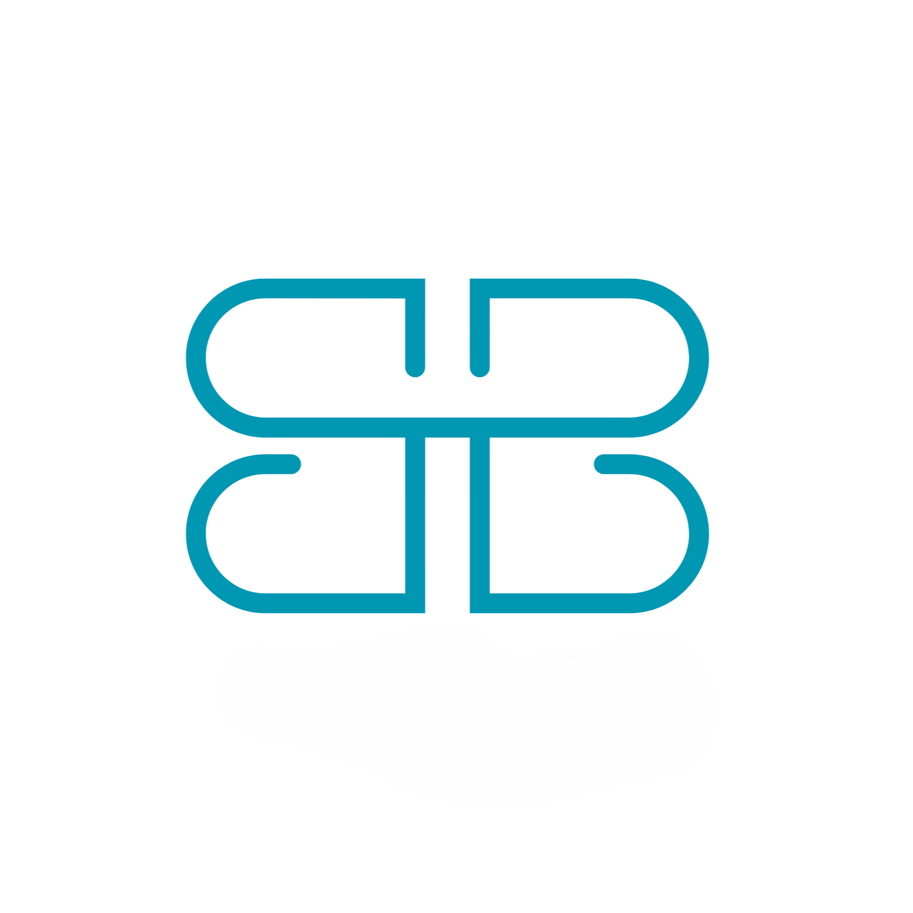

<div align="center">
  
  <h1>🐝 BuyBee</h1>
  <p>A Modern, High-Performance E-Commerce Platform</p>

[](https://nextjs.org/)
[](https://tailwindcss.com/)
[](https://www.mongodb.com/)
[](https://stripe.com/)

</div>

---

## 🌟 Overview

**BuyBee** is a premium e-commerce solution built with the latest web technologies. It provides a seamless shopping experience for users and a robust management dashboard for administrators. From secure authentication to integrated payments, BuyBee covers the entire lifecycle of online retail.

## ✨ Key Features

### 🛒 Customer Features

- **Dynamic Product Catalog**: Browse products by categories with real-time filtering.
- **Interactive Shopping Cart**: Effortlessly add, remove, and manage items.
- **Secure Checkout**: Integrated with **Stripe** for safe and reliable payments.
- **User Profiles**: Manage personal information and view order history.
- **Auth System**: Secure JWT-based authentication with password hashing.
- **Email Notifications**: Automated order confirmations via **Resend**.

### 🛠️ Admin Features

- **Product Management**: Create, edit, and delete products with image uploads.
- **Category Management**: Organize products into logical groups.
- **Order Tracking**: Monitor and update the status of customer orders.
- **User Management**: Oversee the platform's user base.

## 🚀 Tech Stack

- **Framework**: [Next.js 16](https://nextjs.org/) (App Router)
- **Database**: [MongoDB](https://www.mongodb.com/) with [Mongoose](https://mongoosejs.com/)
- **Styling**: [Tailwind CSS 4](https://tailwindcss.com/), [Framer Motion](https://www.framer.com/motion/), [Shadcn UI](https://ui.shadcn.com/)
- **Payments**: [Stripe](https://stripe.com/)
- **Email**: [Resend](https://resend.com/)
- **Media Hosting**: [ImageKit](https://imagekit.io/)
- **Icons**: [HugeIcons](https://hugeicons.com/)

## ⚙️ Getting Started

### Prerequisites

- Node.js 18+
- MongoDB instance (Local or Atlas)
- Stripe Account
- Resend API Key
- ImageKit Account

### Installation

1. **Clone the repository:**

   ```bash
   git clone https://github.com/hamna663/BuyBee.git
   cd BuyBee
   ```

2. **Install dependencies:**

   ```bash
   npm install
   ```

3. **Environment Setup:**
   Create a `.env` file in the root directory and add the following:

   ```env
   MONGODB_URI=your_mongodb_uri
   RESEND_API_KEY=your_resend_api_key
   REFRESH_TOKEN_SECRET=your_refresh_secret
   ACCESS_TOKEN_SECRET=your_access_secret
   IMAGEKIT_PRIVATE_KEY=your_imagekit_private_key
   IMAGEKIT_PUBLIC_KEY=your_imagekit_public_key
   IMAGEKIT_URL_ENDPOINT=your_imagekit_url
   STRIPE_SECRET_KEY=your_stripe_secret
   STRIPE_PUBLISHABLE_KEY=your_stripe_public
   STRIPE_WEBHOOK_SECRET=your_stripe_webhook_secret
   NEXT_PUBLIC_BASE_URL=http://localhost:3000
   ```

4. **Run the development server:**

   ```bash
   npm run dev
   ```

## 📂 Project Structure

```text
├── app/              # Next.js App Router routes & API
├── components/       # Reusable UI components
├── config/           # Database configuration
├── lib/              # Utility functions
├── models/           # Mongoose schemas & models
├── public/           # Static assets (logos, images)
├── schemas/          # Zod validation schemas
└── types.d.ts        # Global TypeScript definitions
```

---

<p align="center">Made by <a href="https://github.com/hamna663">Hamna Tariq</a></p>
